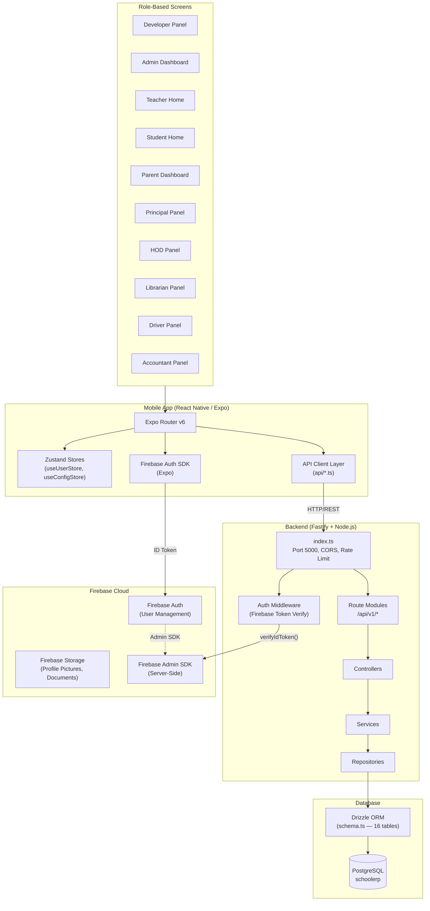
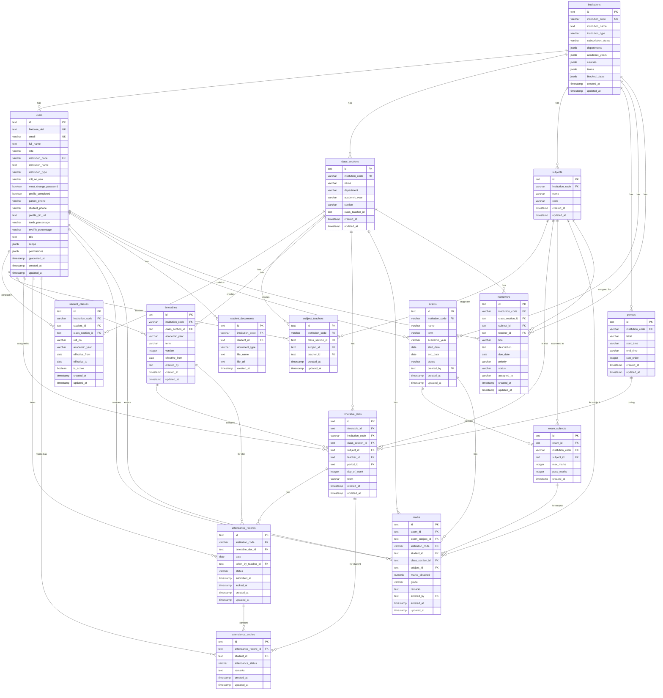
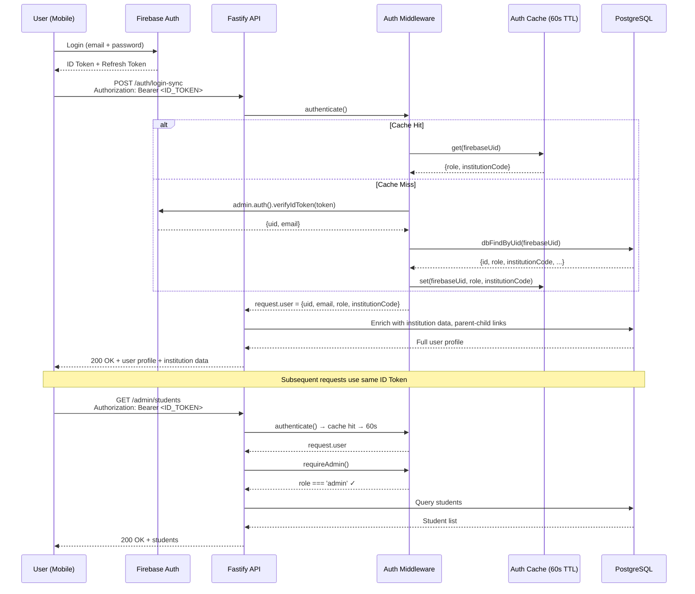
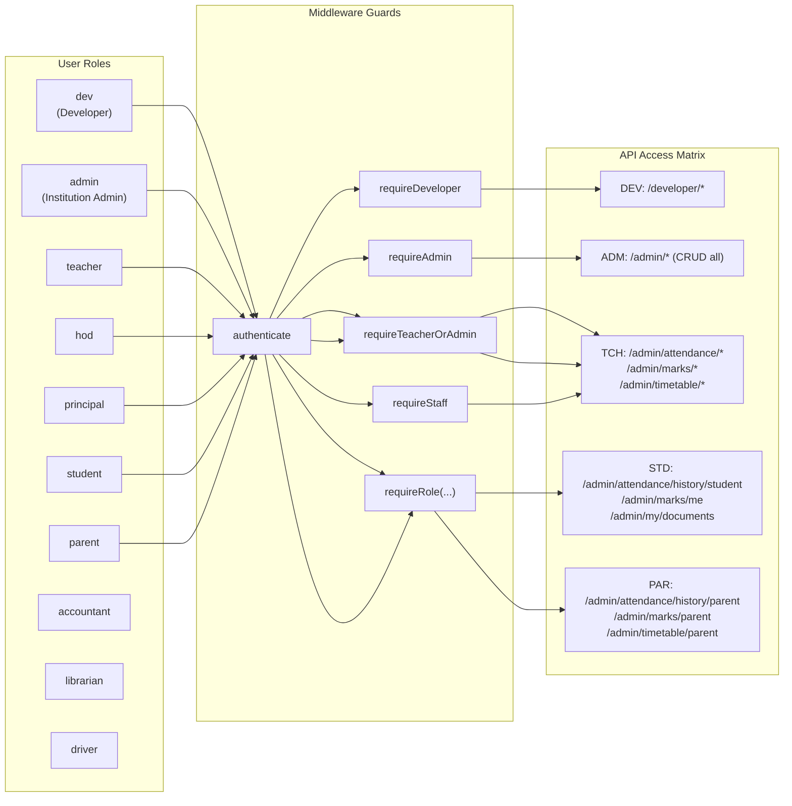
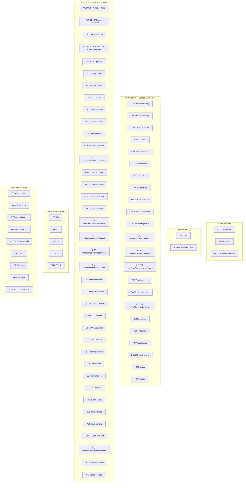
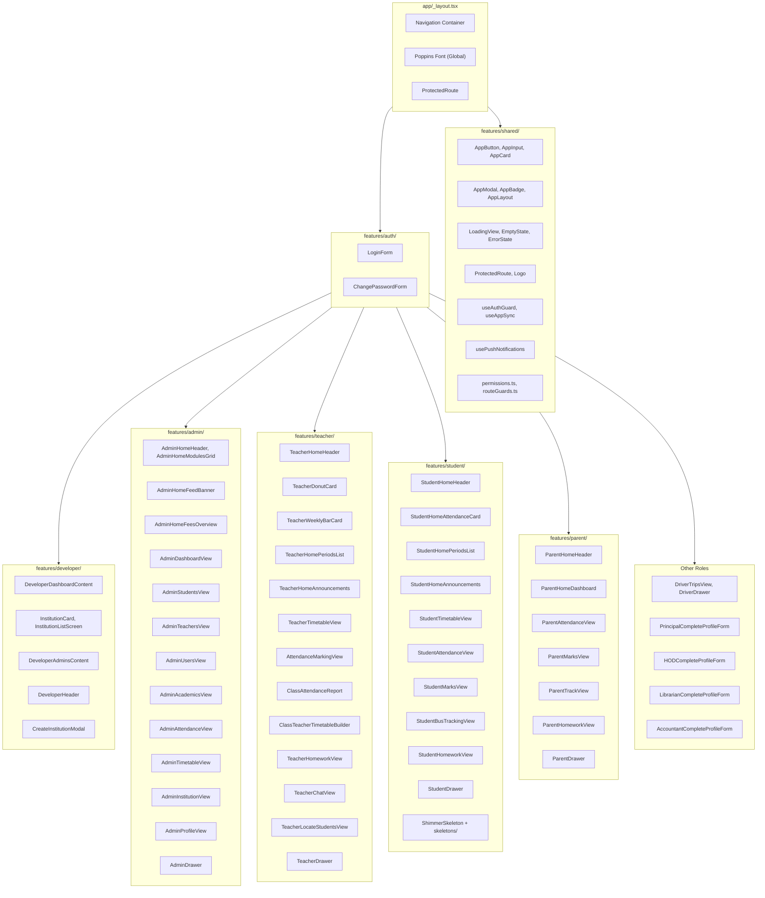
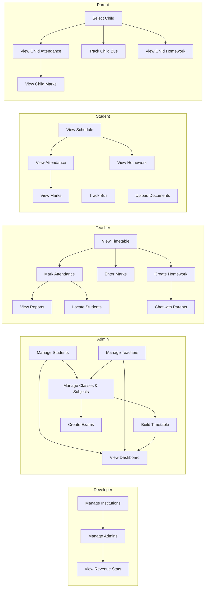
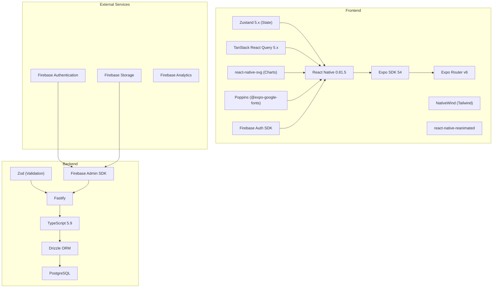
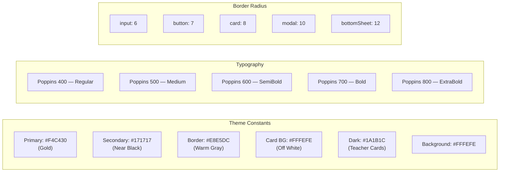

# KIVQUO School ERP — Complete Architecture

> Auto-generated from the full codebase. Open in any Mermaid-compatible viewer (GitHub, VS Code, Notion, etc.)

---

## 1. System Architecture (High-Level)



---

## 2. Database Schema (Entity-Relationship Diagram)



---

## 3. Authentication & Authorization Flow



---

## 4. Role-Based Access Control (RBAC)



| Guard | Allowed Roles |
|-------|--------------|
| `authenticate` | Any valid token |
| `requireDeveloper` | `dev` |
| `requireAdmin` | `admin` |
| `requireTeacherOrAdmin` | `admin`, `teacher`, `hod` |
| `requireStaff` | `admin`, `hod`, `principal`, `teacher` |
| `requireRole(...)` | Custom list per endpoint |

---

## 5. API Route Map (93 Endpoints)



---

## 6. Attendance Flow

```mermaid
sequenceDiagram
    participant ADM as Admin
    participant TCH as Teacher
    participant STD as Student
    participant PAR as Parent
    participant API as Fastify API
    participant DB as PostgreSQL

    Note over ADM,DB: Setup Phase
    ADM->>API: POST /class-sections (create class)
    ADM->>API: POST /subjects (create subjects)
    ADM->>API: POST /subject-teachers (assign teacher)
    ADM->>API: POST /periods (create time slots)
    ADM->>API: POST /timetable (build weekly timetable)
    ADM->>API: POST /students (create students)
    ADM->>API: POST /students/promote (enroll in class)

    Note over TCH,DB: Daily Attendance
    TCH->>API: GET /timetable/me?date=2026-09-05
    API-->>TCH: Today's slots [{slotId, class, subject, period}]

    TCH->>API: GET /attendance/roster?timetableSlotId=ts_xxx
    API->>DB: Query student_classes WHERE class_section_id = ?
    DB-->>API: [{studentId, name, rollNo}]
    API-->>TCH: Roster with students

    loop For each student
        TCH->>API: Toggle present/absent/late/excused
    end

    TCH->>API: POST /attendance/mark<br/>{timetableSlotId, date, entries: [{studentId, status, remarks}]}
    API->>DB: INSERT attendance_records (1 per slot+date)
    API->>DB: INSERT attendance_entries (1 per student)
    DB-->>API: Saved
    API-->>TCH: 200 OK

    Note over STD,PAR: View Attendance
    STD->>API: GET /attendance/history/student?fromDate=&toDate=
    API->>DB: Query attendance_entries JOIN records JOIN slots
    DB-->>API: [{date, subject, status, remarks}]
    API-->>STD: Attendance history

    PAR->>API: GET /attendance/history/parent
    API->>DB: Resolve linkedStudentUSN → student_id
    API->>DB: Query attendance for linked student
    DB-->>API: Attendance data
    API-->>PAR: Child's attendance

    Note over TCH,DB: Reports & Export
    TCH->>API: GET /attendance/report?classSectionId=cs_xxx
    API->>DB: getClassAttendanceReport()
    DB-->>API: {summary, subjects, dailyTrend, lowAttendance, topPerformers}
    API-->>TCH: Report data

    TCH->>API: GET /attendance/export?classSectionId=cs_xxx
    API->>DB: exportClassAttendanceCsv()
    DB-->>API: CSV string
    API-->>TCH: CSV file download
```

---

## 7. Marks & Exam Flow

```mermaid
sequenceDiagram
    participant ADM as Admin/Teacher
    participant TCH as Teacher
    participant STD as Student
    participant PAR as Parent
    participant API as Fastify API
    participant DB as PostgreSQL

    Note over ADM,DB: Exam Setup (Admin Only)
    ADM->>API: POST /exams<br/>{name, term, academicYear, subjects: [{subjectId, maxMarks, passMarks}]}
    API->>DB: INSERT exams + exam_subjects
    API-->>ADM: Exam created (status: draft)

    ADM->>API: PUT /exams/:id {status: "published"}
    API->>DB: UPDATE exam status
    API-->>ADM: Exam published

    Note over TCH,DB: Marks Entry (Teacher)
    TCH->>API: GET /exams?status=published
    API-->>TCH: List of published exams

    TCH->>API: GET /marks?examSubjectId=es_xxx&classSectionId=cs_xxx
    API->>DB: Query marks for exam-subject-class
    DB-->>TCH: [{studentId, name, marksObtained, grade, remarks}]

    loop For each student
        TCH->>API: Enter marks (0-100 or grade)
    end

    TCH->>API: POST /marks<br/>{examSubjectId, classSectionId, entries: [{studentId, marksObtained, grade, remarks}]}
    API->>DB: UPSERT marks (INSERT or UPDATE)
    DB-->>API: Saved
    API-->>TCH: 200 OK

    Note over STD,PAR: View Marks
    STD->>API: GET /marks/me
    API->>DB: Query marks WHERE student_id = current user
    DB-->>API: [{exam, subject, marks, grade, maxMarks, passMarks}]
    API-->>STD: Marks with pass/fail indicators

    PAR->>API: GET /marks/parent
    API->>DB: Resolve linked student → query marks
    DB-->>API: Child's marks
    API-->>PAR: Child's marks

    Note over TCH,DB: Lock Exam (Finalize)
    ADM->>API: PUT /exams/:id {status: "locked"}
    API->>DB: UPDATE exam status (no more edits)
```

---

## 8. Homework Flow

```mermaid
sequenceDiagram
    participant TCH as Teacher
    participant STD as Student
    participant PAR as Parent
    participant API as Fastify API
    participant DB as PostgreSQL

    Note over TCH,DB: Create Homework (Teacher)
    TCH->>API: POST /homework<br/>{classSectionId, subjectId, title, description, dueDate, priority}
    API->>DB: INSERT homework
    API-->>TCH: 201 Created

    Note over STD: View Homework (Student)
    STD->>API: GET /homework?classSectionId=cs_xxx
    API->>DB: Query homework WHERE class_section_id = ? AND status = 'active'
    DB-->>API: [{id, title, subject, dueDate, priority, status}]
    API-->>STD: Homework list

    Note over PAR: View Child's Homework (Parent)
    PAR->>API: GET /homework/parent
    API->>DB: Resolve linkedStudentUSN → classSectionId
    API->>DB: Query homework for child's class
    DB-->>API: [{id, title, subject, dueDate, priority}]
    API-->>PAR: Child's homework

    Note over TCH: Manage Homework (Teacher)
    TCH->>API: PUT /homework/:id<br/>{status: 'completed'}
    API->>DB: UPDATE homework status
    API-->>TCH: 200 OK

    TCH->>API: DELETE /homework/:id
    API->>DB: DELETE homework
    API-->>TCH: 200 OK
```

---

## 9. Timetable Flow

```mermaid
sequenceDiagram
    participant ADM as Admin
    participant TCH as Teacher
    participant STD as Student
    participant API as Fastify API
    participant DB as PostgreSQL

    Note over ADM,DB: Build Timetable
    ADM->>API: POST /periods<br/>{label: "Period 1", startTime: "09:00", endTime: "09:45"}
    ADM->>API: POST /class-sections<br/>{name: "10-A", department: "Science"}
    ADM->>API: POST /subjects<br/>{name: "Mathematics", code: "MATH"}
    ADM->>API: POST /subject-teachers<br/>{classSectionId, subjectId, teacherId}

    ADM->>API: POST /timetable<br/>{classSectionId, academicYear, term, effectiveFrom, slots: [{dayOfWeek, periodId, subjectId, teacherId, room}]}
    API->>DB: INSERT timetables (version auto-increment)
    API->>DB: INSERT timetable_slots (1 per slot)
    DB-->>API: Timetable created (version N)
    API-->>ADM: 200 OK

    Note over TCH,STD: View Timetable
    TCH->>API: GET /timetable/me?date=2026-09-05
    API->>DB: Find timetable WHERE class_section_id = teacher's class AND version = latest
    API->>DB: Filter slots WHERE day_of_week = today
    DB-->>API: [{period, subject, class, room, time}]
    API-->>TCH: Today's schedule

    STD->>API: GET /timetable/class?classSectionId=cs_xxx&date=2026-09-05
    API->>DB: Same logic for student's class
    DB-->>API: Class schedule
    API-->>STD: Today's timetable

    Note over ADM,TCH: Version Control
    ADM->>API: PUT /timetable (new version)
    API->>DB: INSERT new timetable with version = prev + 1
    Note: Old version preserved for historical data
```

---

## 10. Frontend Component Architecture



---

## 11. Data Flow by Role



---

## 12. Technology Stack



---

## 13. File Count Summary

| Layer | Files |
|-------|-------|
| **Server — Routes** | 6 files, 93 endpoints |
| **Server — Controllers** | 6 files, 86 handlers |
| **Server — Services** | 6 files |
| **Server — Repositories** | 5 files |
| **Server — Schema** | 1 file, 16 tables, 30+ indexes |
| **Server — Middleware** | 2 files, 6 guards |
| **Frontend — App Routes** | 30 route files (10 role groups) |
| **Frontend — Features** | 10 feature directories, 76+ components |
| **Frontend — API Client** | 5 files, 60+ exported functions |
| **Frontend — Stores** | 2 Zustand stores |
| **Frontend — Shared** | 12 components, 3 hooks, 2 utils |
| **Database** | 16 tables, 28 relations, 2 migrations |

---

## 14. Color & Design System


